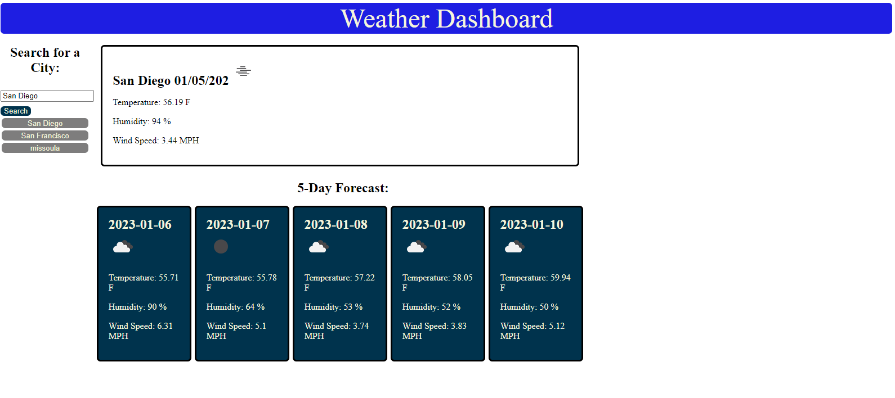

# ch6_baxley_weather_page

API Weather page

## Description

This Challenge was the creation of a Weather Dashboard(https://kaneknah.github.io/ch6_baxley_weather_page/) that would utilize API calls from "OpenWeather API" to check the current weather and the five day forecast for s searched city.

The project utilized such technologies as the before mentioned API, as well as JQuery.

This challenge pushed my abilities further than pervious challenges as I attempted to implement the recently learned Jquery syntax over vanilla Java Script. the changes in syntax, while difficult at first, was a great addition to my understanding and overall ended up making writing this project easier to understand and to code. Another challenge that this project presented with the calling of multiple API functions and rendering them on a single HTML page for viewing. The key to this process was attempting to keep the code as day as possible. I found that not repeating myself with the rendering of the API calls created multiple bugs when the functions ran. Debugging this process, while time consuming and challenging, was highly beneficial to my understanding of the code and the processes involved in creating this challenge project.

This challenge, while demanding, provided me with a great deal of practice and greatly helped build my confidence in my abilities. I feel my understanding of syntax and function processes has increased the most during this challenge and I am proud to see a final product that functions and operates correctly.

This functionality of the challenge is as follows. Firstly, on initialization, a history of the search will be saved to local storage and a button with the name of the searched city will appear. Secondly, a Fetch API function will be called that utilizes two API calls, the single day weather API and the 5-day-forecast API. The results of this will be rendered on the page in a visually appealing format. The data retrieved from the API calls will display the name of the city, date, temperature, wind-speed, and humidity for the current day, as well as the the following forecasted days. The functions also display an icon showing an image representation of the weather(see images below)
ScreenShot #1

Screenshot #2

## User Story

AS A traveler
I WANT to see the weather outlook for multiple cities
SO THAT I can plan a trip accordingly

## Acceptance Criteria

GIVEN a weather dashboard with form inputs
WHEN I search for a city
THEN I am presented with current and future conditions for that city and that city is added to the search history
WHEN I view current weather conditions for that city
THEN I am presented with the city name, the date, an icon representation of weather conditions,
the temperature, the humidity, and the the wind speed
WHEN I view future weather conditions for that city
THEN I am presented with a 5-day forecast that displays the date,
an icon representation of weather conditions, the temperature,
the wind speed, and the humidity
WHEN I click on a city in the search history
THEN I am again presented with current and future conditions for that city

## Installation

No Installation Steps

## Usage

This project can be initiated by entering in a city name into the search field and selecting the search button.This will initialize the API calls and the Local Storage functions. The weather will then be displayed on the screen for the user to review. The user can search a new city in the input field, or select a previously searched city by selecting one of the saved buttons from the local storage call.

## Credits

API provided by OpenWeather API https://openweathermap.org/forecast5.
Javascript Library features provided by JQuery https://jqueryui.com/.

## License

N/A
